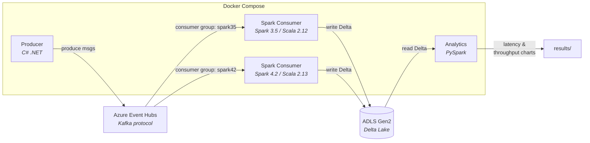
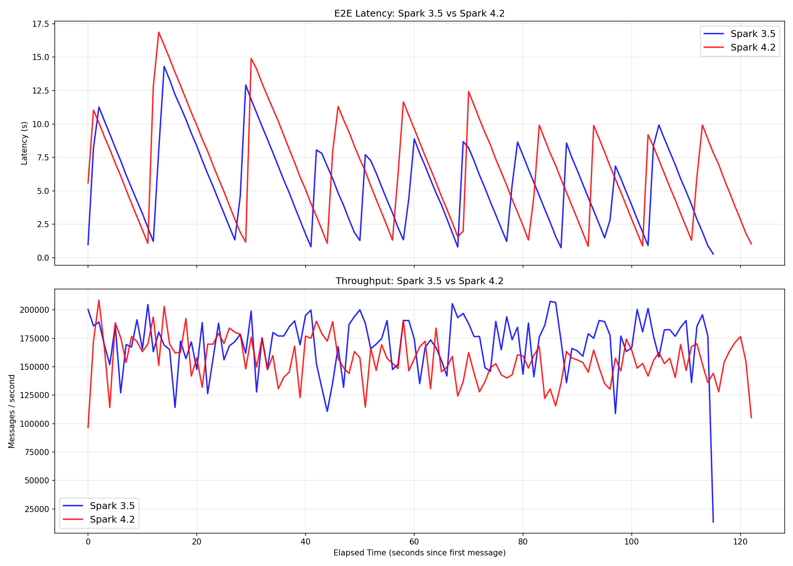

# Stream Processing Benchmark

E2E latency and throughput benchmark:



## Dev Setup

See [`contrib/README.md`](contrib/README.md).

## Quickstart

Azure CLI (`az`) logged in with access to your target subscription:

```bash
az login
az account set -s <subscription-id>
```

### 1. Deploy Azure infrastructure

```bash
./src/infra/deploy.sh --subscription <subscription-id> --resource-group <rg-name>
```

This creates the Azure resource group (if needed), deploys Event Hubs and ADLS Gen2 via Bicep, and hydrates `.env` from `.env.template`.

### 2. Run benchmark

```bash
./src/.scripts/benchmark.sh 360
```

### 3. Destroy infrastructure

```bash
./src/infra/destroy.sh --subscription <subscription-id> --resource-group <rg-name>
```

This deletes the resource group and all resources within, and removes `.env`.

