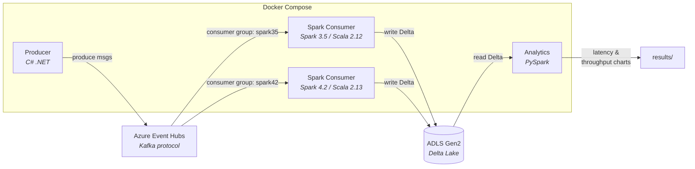

# Stream Processing Benchmark

E2E latency and throughput benchmark:



## Dev Setup

See [`contrib/README.md`](contrib/README.md).

## Prerequisites

> TODO: Automate this with bicep and only prompt the user for Subscription ID and RG Name, fire a single "run.sh".

1. Azure Event Hub with consumer groups `spark35` and `spark42`
2. ADLS Gen2 storage account + container (HNS enabled)
3. `cp .env.template .env` and fill in credentials

## Usage

```bash
# Specify duration in seconds and run benchmark
./src/.scripts/benchmark.sh 360
```

